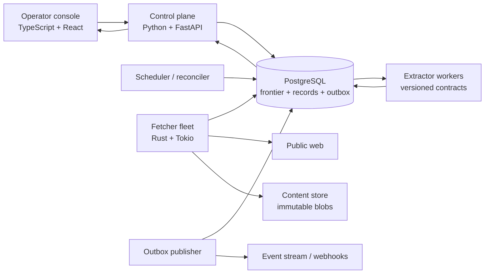

# Skein architecture

Skein is an observability-first crawling control plane. The repository is intentionally split into a high-velocity control plane and a narrow, memory-safe data plane:

- TypeScript/React operator console for crawl design, live operations, lineage, and quality review.
- Python/FastAPI control plane for policy validation, run creation, and workflow orchestration.
- Rust fetcher safety kernel for hostile-network I/O, byte limits, hashing, and retry classification.
- PostgreSQL durable state machine for the frontier, leases, audit events, records, and a transactional outbox.
- Nix development shell and Linux containers for reproducible local and production environments.

The current vertical slice implements the operator console, real bounded local crawler, robots and redirect policy, live progress/ETA/results lifecycle, durable schema, PostgreSQL frontier claim query, URL/DNS safety rules, Rust safety primitives, and exhaustive test harness. The horizontally distributed Rust worker adapter and browser-render sandbox are the next scale milestone; their contracts can be added without reworking the product or data boundaries.

## System map

The database is the source of truth. Workers use short, renewable leases and idempotent writes. A worker may run a task more than once, but a canonical URL can only be admitted once per run and a fetched body is addressed by its content hash.

## Correctness model

1. The API canonicalizes and validates a seed before a transaction begins.
2. One transaction inserts the run, initial frontier item, and `crawl.run.created` outbox event.
3. Workers claim ready rows with `FOR UPDATE SKIP LOCKED`, attach an owner and deadline, then commit quickly.
4. Network work happens outside the claim transaction.
5. Results are committed with a compare-and-swap predicate on `id`, `lease_owner`, and an unexpired deadline.
6. If a worker dies, the reconciler returns expired leases to `ready`.
7. Retryable failures use capped full-jitter backoff. Terminal policy failures are retained as audit events, not silently dropped.
8. Extracted records include source URL, source digest, extractor version, schema version, confidence, and quarantine state.

This is at-least-once execution with effectively-once effects at each durable boundary. It avoids the failure mode where a queue acknowledgement succeeds but the corresponding database write does not.

## Frontier and scheduling

The frontier is a PostgreSQL state machine:

`ready → leased → fetched | retry_wait | blocked | failed`

Admission has three layers:

- Run identity: `(run_id, url_hash)` prevents duplicate work.
- Host policy: per-host rate, concurrency, robots decision, and circuit state.
- Global budget: pages, bytes, wall time, and depth are hard caps.

The first production scale step is table partitioning by `run_id` hash and time-partitioned event/document tables. The second is regional frontier shards with a consistent host-to-shard assignment, keeping a hostname on one scheduler so politeness is globally enforceable. PostgreSQL remains the metadata authority; response bodies move to an S3-compatible content store once inline retention becomes expensive.

## Data contracts

All cross-process payloads are versioned. Changes follow expand/migrate/contract:

- Add nullable or defaulted fields.
- Deploy readers that understand both versions.
- Deploy writers for the new version.
- Backfill with checkpointed jobs.
- Remove the old representation only after compatibility telemetry reaches zero.

JSON is used for flexible policy and extracted attributes; high-cardinality operational fields are typed columns with checks and indexes. User-authored selectors run inside an isolated extractor process with CPU, memory, and wall-clock limits.

## Observability and self-testing nodes

Every stage emits a structured event with `run_id`, `frontier_id`, `trace_id`, attempt, duration, bytes, and a stable outcome code.

| Node | Before work | During work | After work |
| --- | --- | --- | --- |
| Admit | URL/policy contract | transaction invariant | outbox and seed exist |
| Resolve | hostname/port policy | all answers are public | chosen answer recorded |
| Fetch | robots, budget, lease | time/byte/redirect caps | digest and status recorded |
| Parse | media and encoding gate | bounded parser | link count and parse errors |
| Extract | schema + fixture | sandbox limits | contract validation |
| Persist | lease ownership | idempotent upsert | lineage completeness |
| Publish | outbox ownership | retry + dead letter | consumer acknowledgement |

The Quality Lab mirrors these gates in the product so an operator can run adversarial fixtures before scheduling a crawl.

## Reliability targets

Initial service objectives:

- Control-plane availability: 99.9% monthly.
- Run creation: p95 under 250 ms excluding identity-provider latency.
- Lease recovery: 99% within two lease periods.
- Duplicate persistent documents: below 0.01% per run.
- Missing lineage on accepted records: zero.
- Operator event freshness: p95 below five seconds.

Budgets are visible product controls, not hidden configuration. When a cap is reached, the run pauses with a typed reason and a resumable checkpoint.

## Deployment

Local development uses Nix and `just`. Containers run as UID 10001 with a read-only filesystem, dropped capabilities, and a tmpfs. Production uses separate service identities and database roles:

- `skein_api`: create/read runs, no migration rights.
- `skein_fetcher`: claim and finish frontier rows, no arbitrary schema access.
- `skein_migrator`: migration only, invoked as a controlled job.
- `skein_reader`: read-only analytics and support access.

Secrets arrive through the platform secret manager. Images are pinned by digest in release manifests, generate an SBOM, and are signed before promotion.

## Deliberate non-goals

Skein does not bypass authentication, CAPTCHAs, paywalls, robots policy, or access controls. It does not ship stealth or fingerprint-evasion features. The system is built for authorized, policy-compliant collection with explicit provenance and deletion controls.
